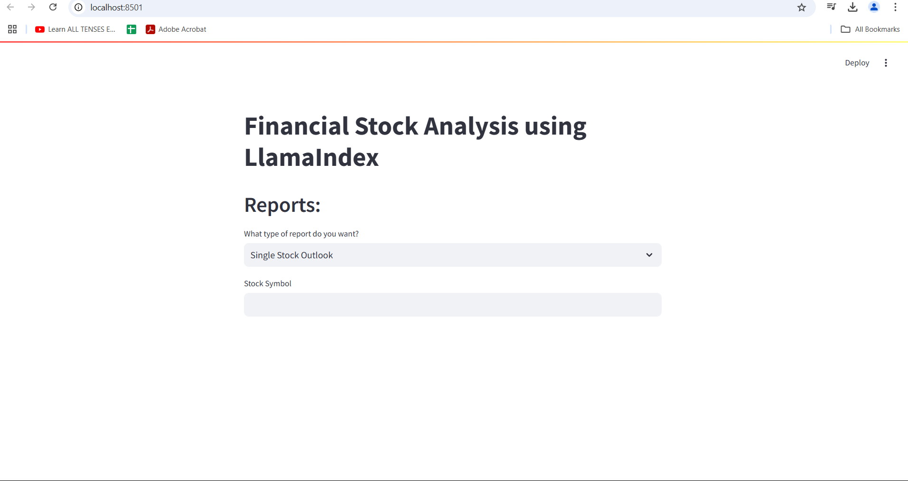

# Financial-Stock-Analysis-using-LlamaIndex




### Techology used

 - Llama Index
 - GPT-4
 - Streamlit


Note: use Python version 3.10


# How to run?
### STEPS:

Clone the repository

```bash
git clone "repository"
```
### STEP 01- Create a conda environment after opening the repository

```bash
conda create -n fin python=3.10 -y
```

```bash
conda activate fin
```


### STEP 02- install the requirements
```bash
pip install -r requirements.txt
```


```bash
# Finally run the following command
streamlit run app.py
```

Now,
```bash
open up you local host and port 8501
```


symbols of stock = ['MSFT', 'NVDA', 'GOOG', 'META', 'AAPL', 'TSM']
